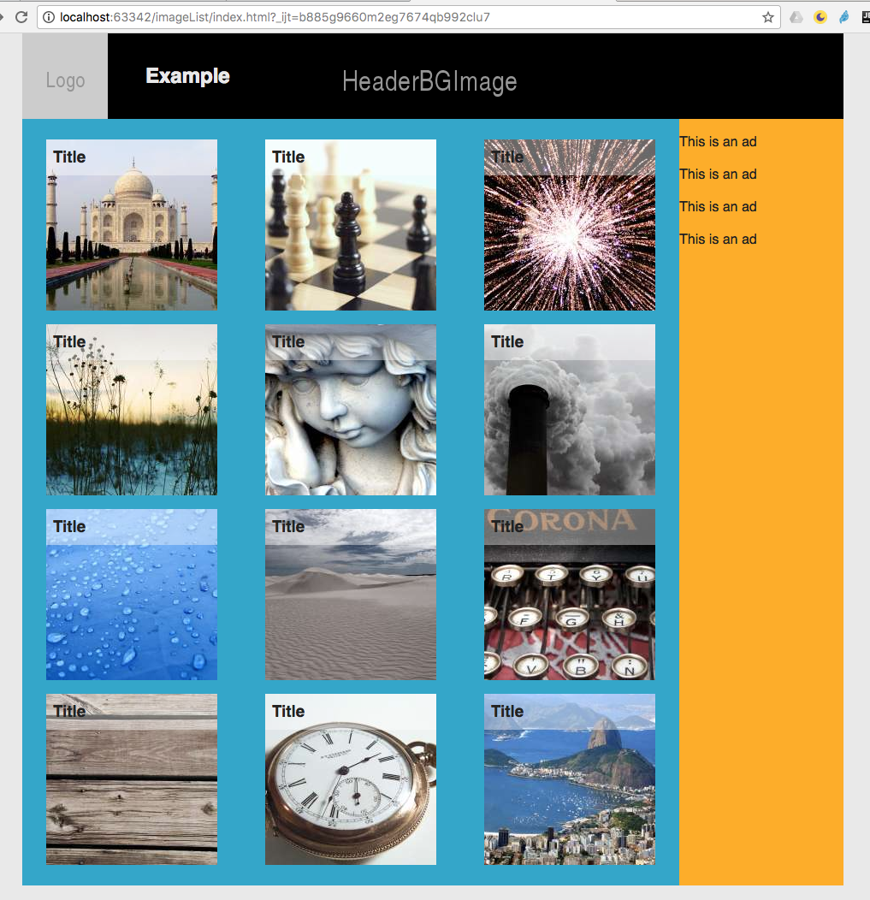

# CSS Exercise - Image List

Solution - http://10.114.32.174/Test/Task1ImageList/imageList/
1. Edit css/main.css
  * The thumbnails (li elements) should form a grid
  * The title of the image (h3 element) should be on top of the thumbnails
  * On desktop main and aside elements should be side by side
  
>Example layout:

  
  
  * Extra: On mobile main and aside elements should be one below the other

